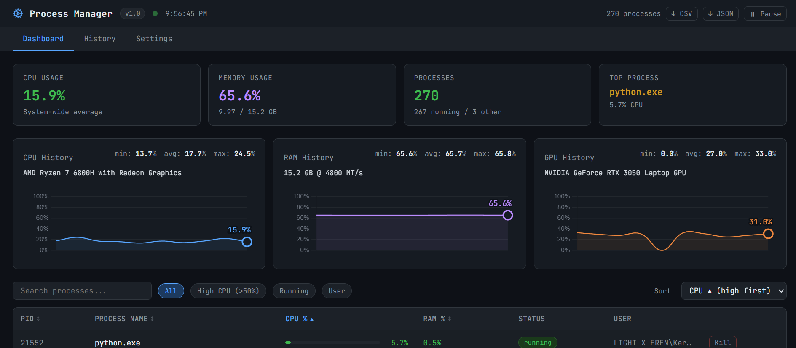
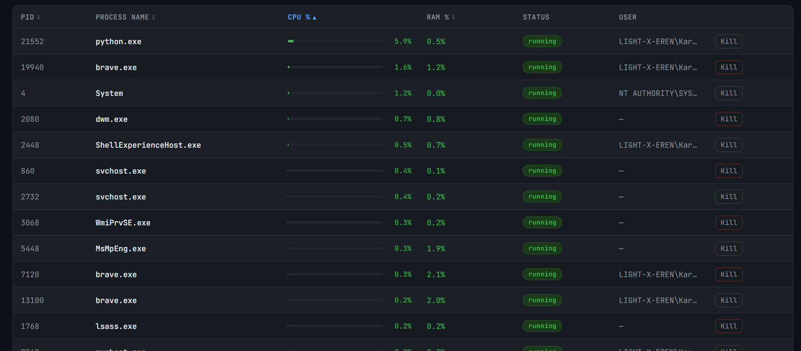
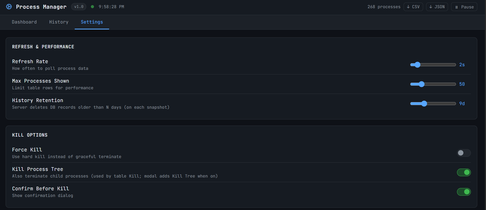
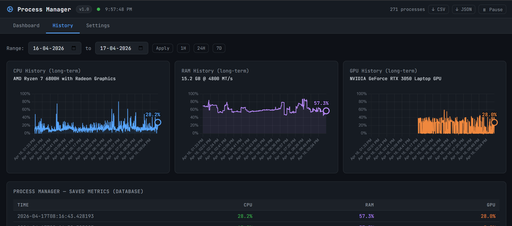
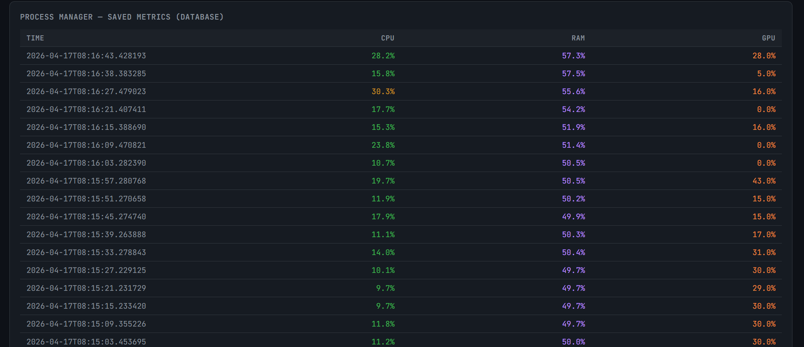

# process-monitor
   

Local system and process monitor with a Python backend and React frontend.
Runs on `127.0.0.1` only, with no cloud dependency.
No telemetry, no account, no external data pipeline.

## Features
| Area | What it includes |
|---|---|
| Process Table | Live rows with PID, process name, CPU%, RAM%, status, and user |
| Search/Filter/Sort | Search plus filters; sorting by CPU, RAM, PID, and name |
| Noise Reduction | Hides `System Idle Process` and unnamed process entries |
| Process Control | Kill Process, Kill Tree, Force Kill, optional confirm dialog |
| Windows Tree Kill | Uses `taskkill /T` path for process-tree termination |
| System Metrics | Real-time CPU, RAM, network, and disk activity |
| Hardware Context | Shows CPU, RAM, and GPU hardware names in UI |
| Charts | Live and historical CPU/RAM/GPU with min/avg/max stats |
| Chart Readability | End-point markers and current-value labels |
| Export | CSV and JSON export for process and history views |
| Persistence | SQLite history with 1–90 day retention window |
| Data Hygiene | Automatic cleanup of expired snapshots |
| Write Protection | Snapshot throttling to prevent DB overload |



## Tech Stack
| Layer | Technology |
|---|---|
| Backend | FastAPI + psutil + SQLAlchemy async + SQLite (`aiosqlite`) |
| Frontend | React + Vite + Chart.js |
| Launcher | `launch-process-manager.bat` (Windows) |

## Getting Started
### Prerequisites
- Python 3.10+
- Node.js 18+
- npm

### Installation
```powershell
# Windows (PowerShell)
python -m venv venv
.\venv\Scripts\activate
pip install -r requirements.txt
```

```bash
# macOS/Linux
python -m venv venv
source venv/bin/activate
pip install -r requirements.txt
```

```bash
cd frontend
npm install
```

### Launch
**Option A — Windows launcher**  
Double-click `launch-process-manager.bat`.

1. Creates `venv` if missing
2. Installs Python dependencies from `requirements.txt`
3. Installs frontend dependencies if `frontend/node_modules` is missing
4. Starts API and UI in separate terminal windows

**Option B — Manual**
```bash
python -m uvicorn backend.main:app --host 127.0.0.1 --port 8000 --reload
```

```bash
cd frontend
npm run dev
```

**Default URLs**
- API: http://127.0.0.1:8000
- UI: http://localhost:5173



## Project Structure
```text
process-monitor/
├── backend/
│   ├── main.py                  # DB init + router mounting
│   ├── scraper.py               # fast list + deep per-process detail
│   ├── snapshots.py             # throttled snapshot writes
│   ├── database.py              # async engine/session + schema init
│   ├── models.py                # system_history model
│   └── routers/
│       ├── processes.py         # kill logic + error handling
│       └── history.py           # date-range queries + retention
├── frontend/
│   └── src/
│       ├── App.jsx              # UI, charts, process actions, settings
│       └── index.css            # styling
├── launch-process-manager.bat
├── requirements.txt
└── process_monitor.db
```

## Configuration
| Setting | Description |
|---|---|
| Refresh interval | Poll interval for system/process updates |
| Max rows | Maximum process rows rendered in table |
| Retention days | History retention window (1–90 days) |
| Force kill | Uses hard kill instead of graceful terminate |
| Kill tree | Includes child processes during kill operations |
| Confirm kill | Shows confirmation prompt before kill actions |
| API base URL | Overrides backend endpoint used by frontend |


> Note: runs on 127.0.0.1 by default. Retention cleanup runs on snapshot writes.

## API Overview
| Method | Endpoint | Description |
|---|---|---|
| GET | `/` | API status and version payload |
| GET | `/system` | Real-time system metrics and throttled snapshot write |
| GET | `/processes/` | Fast process list for table view |
| GET | `/processes/{pid}` | Deep details for a single process |
| POST | `/processes/kill/{pid}` | Kill process/tree with `force` and `tree` options |
| GET | `/history/` | History points with optional date-range filters |
| POST | `/history/retention` | Updates retention days (1–90) |

## Screenshots




## Contributing
1. Fork the repository
2. Create a feature branch
3. Test your changes locally
4. Open a pull request with a clear summary

For large changes, open an issue first to align scope.

## License
MIT — see [LICENSE](LICENSE)
